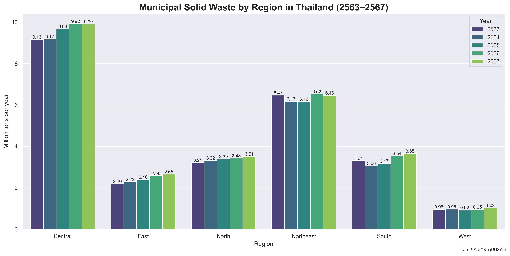
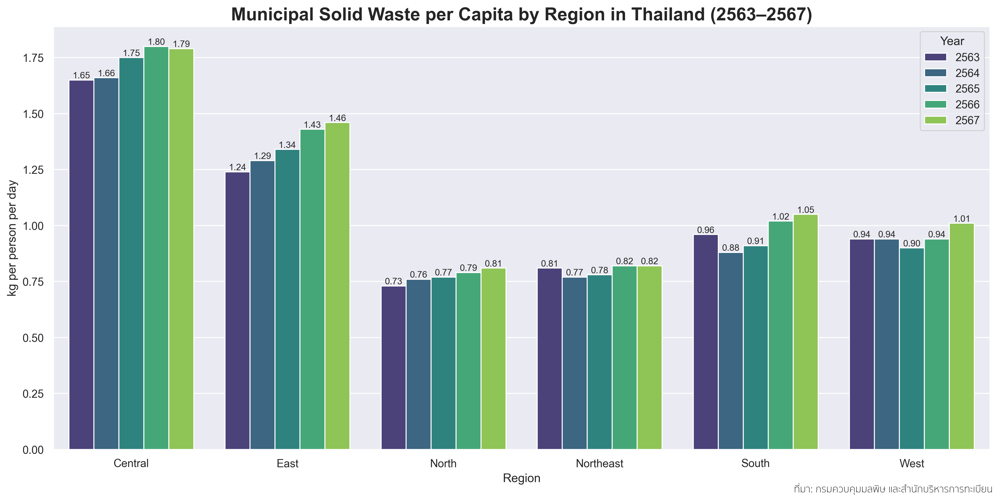
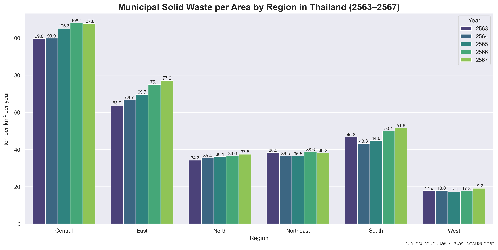
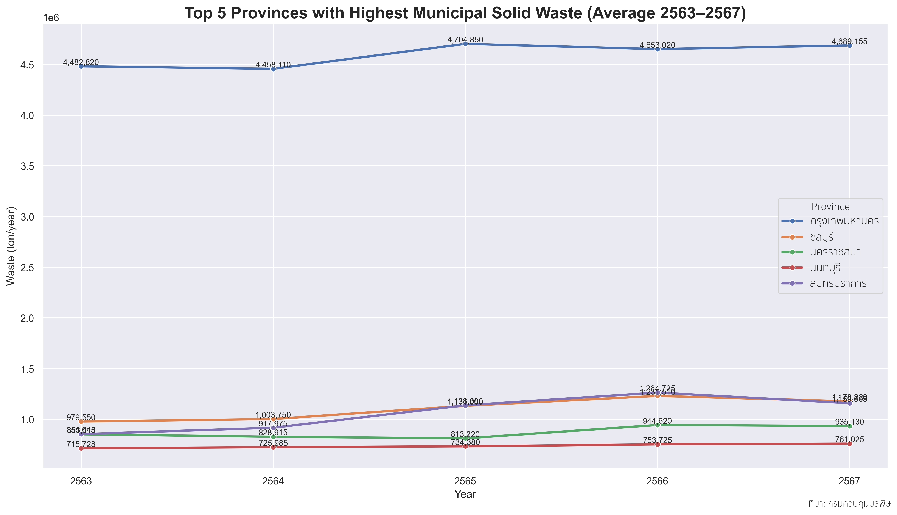
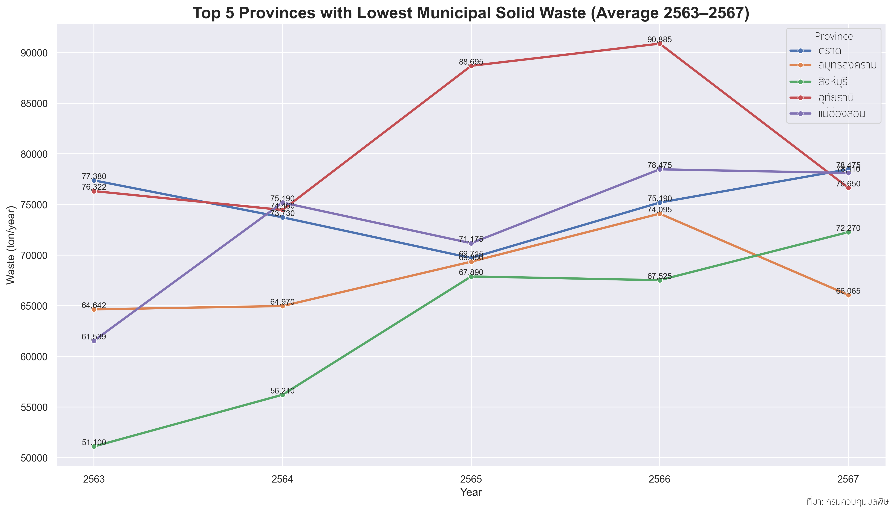
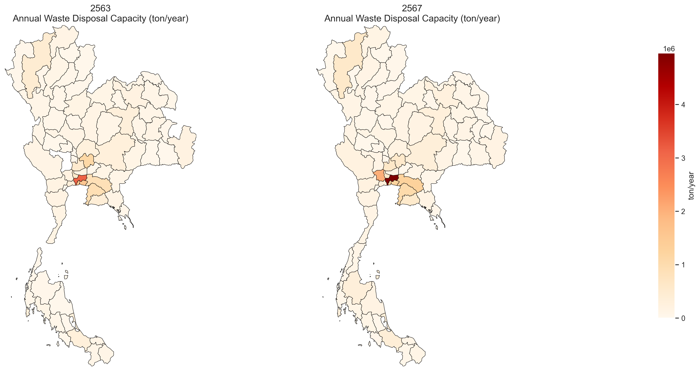
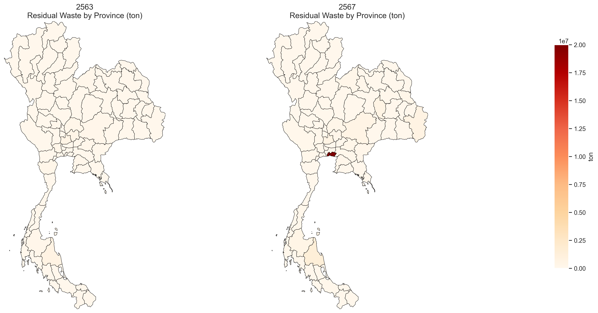
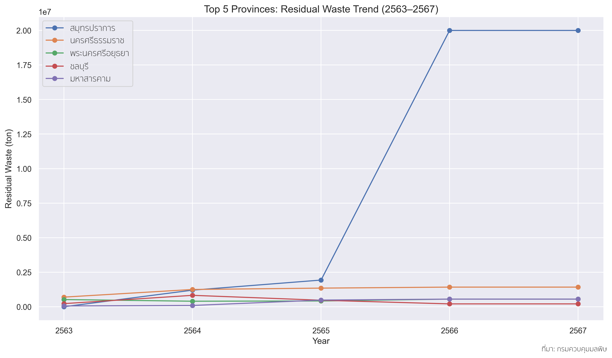
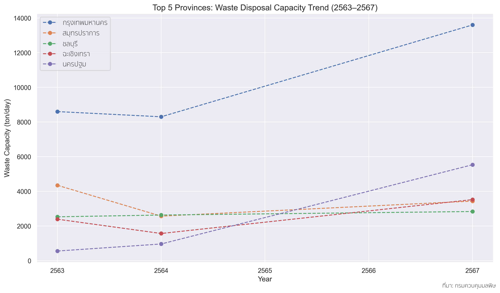
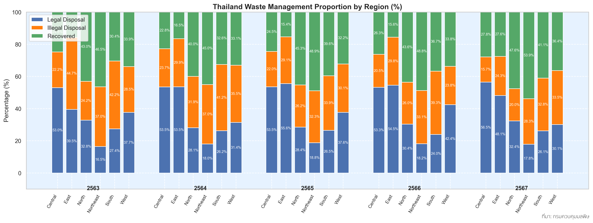

# Municipal-solid-waste: An indicator reflecting inequality

## <mark>The expansion of municipal solid waste

<table>
  <tr>
    <th>Graph 1: ASEAN Municipal Solid Waste per Capita</th>
    <th>Graph 2: ASEAN Annual Municipal Solid Waste</th>
  </tr>
  <tr>
    <td></td>
    <td></td>
  </tr>
</table>

จากกราฟที่ 1 และ 2 พบว่า ในปี 2559 ประเทศไทยมีปริมาณขยะมูลฝอยรวมประมาณ 26.77 ล้านตันต่อปี อยู่ในอันดับที่ 2 ของอาเซียน รองจากอินโดนีเซีย ขณะที่ปริมาณขยะต่อหัวประชากรอยู่ที่ประมาณ 1.05 กิโลกรัมต่อคนต่อวัน จัดอยู่ในอันดับที่ 4 ของภูมิภาค สะท้อนให้เห็นว่าประเทศไทยเป็นหนึ่งในประเทศที่มีระดับการเกิดขยะค่อนข้างสูง ทั้งในเชิงปริมาณรวมและเชิงต่อหัวประชากร

## Graph 3 Thailand MSW Trend

จากกราฟที่ 3 แสดงให้เห็นว่าประเทศไทยผลิตขยะมูลฝอยหลายสิบล้านตันต่อปี และปริมาณมีแนวโน้มเพิ่มขึ้นอย่างต่อเนื่องตั้งแต่ปี 2564 โดยคาดว่าเพิ่มขึ้นตามการขยายตัวของเมือง จำนวนประชากร การท่องเที่ยว พฤติกรรมการใช้ทรัพยากร เช่น การใช้ครั้งเดียวแล้วทิ้ง และพฤติกรรมการใช้ชีวิตที่เปลี่ยนแปลงไป เช่น การสั่งอาหารส่งถึงบ้านที่คาดว่ามีปริมาณมากขึ้นหลังวิกฤตโควิด-19 เป็นต้น
หากมองไปถึงเบื้องหลังเกี่ยวกับการจัดการขยะมูลฝอยเหล่านั้น ดูเหมือนในเมืองใหญ่น่าจะมีการจัดการที่ดี มีรถเก็บขยะในทุกเช้า มีระบบคัดแยกและกำจัดที่ทันสมัย แต่ในชนบทบางแห่งยังคงมีการเผาขยะกลางแจ้งหรือทิ้งรวมกันโดยไร้ระบบจัดการ ซึ่งคาดว่าเกิดจากการขาดงบประมาณ เทคโนโลยี และการสนับสนุนที่เพียงพอ ทำให้ภาระของขยะไม่ได้ตกอยู่กับทุกคนอย่างเท่าเทียมกัน

จากข้อความข้างต้น จึงเกิดประเด็นคำถามที่ว่า ปริมาณขยะมูลฝอยมีความสัมพันธ์กับความเหลื่อมล้ำทางเศรษฐกิจและสังคมในประเทศไทยจริงหรือไม่ และสัมพันธ์กันอย่างไร โดยมีประเด็นคำถามที่สำคัญ ดังนี้
1.	ระบบการจัดการขยะมูลฝอย ได้แก่ การกำจัดขยะมูลฝอยอย่างถูกต้องและไม่ถูกต้อง และการนำขยะมูลฝอยกลับมาใช้ประโยชน์ ส่งผลต่อภาระขยะมูลฝอยของแต่ละภูมิภาคในประเทศไทยหรือไม่ อย่างไร
2.	สถานที่กำจัดขยะมูลฝอยในปัจจุบันมีจำนวนและศักยภาพเพียงพอต่อปริมาณขยะมูลฝอยที่เกิดขึ้นหรือไม่ เมื่อพิจารณาจากกำลังการรองรับ (Capacity) ของสถานที่กำจัดขยะมูลฝอยเทียบกับปริมาณขยะมูลฝอยที่เกิดขึ้นและปริมาณขยะมูลฝอยตกค้าง
3.	ฐานะทางเศรษฐกิจและสังคมของแต่ละภูมิภาค โดยพิจารณาจากผลิตภัณฑ์มวลรวมจังหวัด (GPP) จำนวนโรงงาน จำนวนนักท่องเที่ยว และจำนวนประชากร ส่งผลต่อปริมาณขยะมูลฝอยที่เกิดขึ้นและการจัดการขยะเหล่านั้นหรือไม่ อย่างไร

## <mark>Sources of municipal solid waste

## Graph 4 Thailand MSW by Region

<table>
  <tr>
    <th style="text-align:center;">
      Graph 5: Thailand MSW per Capita by Region
    </th>
    <th style="text-align:center;">
      Graph 6: Thailand MSW per Area by Region
    </th>
  </tr>
  <tr>
    <td>
      
    </td>
    <td>
      
    </td>
  </tr>
</table>

จากกราฟที่ 4-6 ตั้งแต่ปี พ.ศ.2563-2567 พบว่าทุกภูมิภาคมีแนวโน้มของปริมาณขยะมูลฝอยที่เพิ่มขึ้น โดยภาคกลางมีปริมาณขยะมูลฝอยมากที่สุด ทั้งในแง่ของปริมาณขยะมูลฝอยรวม ปริมาณขยะมูลฝอยต่อหัว และปริมาณขยะมูลฝอยต่อพื้นที่ อีกทั้งยังเป็นปริมาณที่สูงมาก แตกต่างกับภาคอื่นๆ อย่างมีนัยสำคัญ ดังนั้น ภาคกลางจึงเป็นแหล่งหลักที่ก่อเกิดขยะมูลฝอยของประเทศไทยอย่างชัดเจน แต่ภาคตะวันออกและภาคใต้มีการเพิ่มขึ้นของขยะมูลฝอยที่ค่อนข้างเร็วเมื่อเทียบกับภาคอื่นๆ โดยภาคตะวันออกมีปริมาณขยะมูลฝอยต่อหัวและปริมาณขยะมูลฝอยต่อพื้นที่สูงเป็นอันดับสองรองมาจากภาคกลาง สะท้อนถึงความเป็นเมืองที่มีความหนาแน่นของประชากร ในขณะที่ภาคตะวันออกเฉียงเหนือมีปริมาณขยะมูลฝอยรวมมากเป็นอันดับสอง รองจากภาคกลาง แต่ปริมาณขยะมูลฝอยต่อหัวและปริมาณขยะมูลฝอยต่อพื้นที่อยู่ในระดับปานกลางเมื่อเทียบกับภาคอื่นๆ ส่วนภาคตะวันตกมีปริมาณขยะมูลฝอยรวมและปริมาณขยะมูลฝอยต่อพื้นที่น้อยที่สุด

<table>
  <tr>
    <th>Graph 7: Top 5 MSW Trend</th>
    <th>Graph 8: Bottom 5 MSW Trend</th>
  </tr>
  <tr>
    <td></td>
    <td></td>
  </tr>
</table>

เมื่อพิจารณาแยกรายจังหวัด พบว่า กรุงเทพฯ มีปริมาณขยะมูลฝอยเฉลี่ยตั้งแต่ปีพ.ศ.2563-2567 มากที่สุด และปริมาณดังกล่าวเป็นปริมาณที่มากอย่างมีนัยสำคัญเมื่อเทียบกับจังหวัดอื่น (ปริมาณขยะมูลฝอยรวมประมาณ 4.60 ล้านตันต่อปี) สอดคล้องกับภาคกลางที่มีปริมาณขยะมูลฝอยมากที่สุด แต่ปริมาณเพิ่มขึ้นเล็กน้อย ค่อนข้างทรงตัว ดังแสดงในกราฟที่ 7 รองลงมาจะเป็นชลบุรี สมุทรปราการ นครราชสีมา และนนทบุรี (ปริมาณขยะมูลฝอยรวมอยู่ในช่วง 0.70-1.30 ล้านตันต่อปี) ในขณะที่กราฟที่ 8 แสดงจังหวัดตราด สมุทรสงคราม สิงห์บุรี อุทัยธานี และแม่ฮ่องสอน มีปริมาณขยะมูลฝอยน้อยที่สุด (ปริมาณขยะมูลฝอยรวม 0.50-0.90 ล้านตันต่อปี) จึงจะเห็นได้ว่าปริมาณขยะมูลฝอยที่เกิดขึ้นมีความต่างกันหลายเท่าระหว่างจังหวัด

## Graph 9 Population, GPP, Factory and Tourist vs Waste by Region (2566)
_v2.png)

หมายเหตุ : ประเทศไทยมีการแบ่งภูมิภาคไม่สอดคล้องกันในแต่ละแหล่งข้อมูล โดยบางแหล่งแบ่งเป็น 5 ภาค และบางแหล่งแบ่งเป็น 6 ภาค ดังนั้นในการวิเคราะห์นี้จึงได้ปรับข้อมูลให้เป็นการแบ่งแบบ 5 ภาคเพื่อให้เกิดความสอดคล้องกัน

หากพิจารณาปริมาณขยะมูลฝอยในแต่ละภาคเทียบกับตัวแปรที่คาดว่าเป็นปัจจัยที่ทำให้เกิดขยะมูลฝอย โดยในที่นี้จะพิจารณาเฉพาะจำนวนประชากร จำนวนโรงงาน จำนวนนักท่องเที่ยว และผลิตภัณฑ์มวลรวมจังหวัด จากข้อมูลในปี 2566 (เนื่องจากข้อจำกัดของข้อมูล) ตามกราฟที่ 9 พบว่า
- จำนวนประชากรมีความสัมพันธ์เชิงบวกที่ค่อนข้างสูงกับปริมาณขยะมูลฝอย : ภาคที่มีจำนวนประชากรมากอย่างภาคกลางจะมีขยะมูลฝอยปริมาณมาก ภาคที่มีจำนวนประชากรน้อยอย่างภาคตะวันออกจะมีขยะมูลฝอยปริมาณน้อย สะท้อนให้เห็นว่าประชากรเป็นปัจจัยสำคัญที่ทำให้เกิดขยะมูลฝอย
- จำนวนโรงงานมีความสัมพันธ์เชิงลบเล็กน้อยกับปริมาณขยะมูลฝอย : ภาคตะวันออกที่มีโรงงานจำนวนมาก แต่มีปริมาณขยะมูลฝอยน้อย ในขณะที่ภาคกลางมีปริมาณขยะมูลฝอยมากที่สุด แต่จำนวนโรงงานไม่ได้มากนักเมื่อเทียบกับปริมาณขยะมูลฝอย ดังนั้น จำนวนโรงงานไม่ได้สัมพันธ์กับปริมาณขยะมูลฝอยโดยตรง อาจเนื่องมาจากโรงงานมักมีระบบจัดการขยะตามมาตรฐานอุตสาหกรรม
- จำนวนนักท่องเที่ยวมีความสัมพันธ์เชิงบวกในระดับปานกลางกับปริมาณขยะมูลฝอย : ภาคกลางมีปริมาณขยะมูลฝอยมากตามจำนวนนักท่องเที่ยว ภาคใต้มีนักท่องเที่ยวจำนวนมาก แต่ปริมาณขยะมูลฝอยไม่ได้มากนัก ในขณะที่ภาคตะวันออกเฉียงเหนือมีปริมาณขยะมูลฝอยมากเมื่อเทียบกับจำนวนนักท่องเที่ยว สะท้อนให้เห็นว่าการท่องเที่ยวอาจส่งผลต่อปริมาณขยะมูลฝอย แต่ไม่ใช่ปัจจัยหลัก นักท่องเที่ยวเป็นประชากรแฝงที่มีส่วนในการเพิ่มภาระขยะ
- ผลิตภัณฑ์มวลรวมจังหวัดมีความสัมพันธ์เชิงบวกสูงมากกับปริมาณขยะมูลฝอย : ภาคที่มีผลิตภัณฑ์มวลรวมจังหวัดสูงอย่างภาคกลางจะมีขยะมูลฝอยปริมาณมาก ภาคที่มีผลิตภัณฑ์มวลรวมจังหวัดต่ำอย่างภาคเหนือ ใต้ และตะวันออกจะมีขยะมูลฝอยปริมาณน้อย จึงอนุมานได้ว่า พื้นที่ที่มีฐานะทางเศรษฐกิจสูงมักจะสร้างขยะมากขึ้นจากกิจกรรมทางเศรษฐกิจและการบริโภค

จากการวิเคราะห์เบื้องต้น พบว่า ผลิตภัณฑ์มวลรวมจังหวัดและจำนวนประชากรเป็นปัจจัยสำคัญที่ทำให้เกิดขยะมูลฝอย จำนวนนักท่องเที่ยวเป็นปัจจัยหนึ่งที่มีส่วนในการสร้างขยะมูลฝอยเพิ่มขึ้น แต่จำนวนโรงงานไม่ได้ส่งผลต่อปริมาณขยะมูลฝอยอย่างมีนัยสำคัญ

## <mark>Structure of the municipal solid waste management system

## Graph 10 Annual waste disposal capacity

## Graph 11 Residual waste map

จากกราฟที่ 10 แสดงให้เห็นว่าแหล่งกำจัดขยะมูลฝอยที่มีศักยภาพในการทำงานสูงจะกระจุกตัวอยู่ในภาคกลาง โดยเฉพาะบริเวณกรุงเทพฯ และปริมาณมณฑล สอดคล้องกับปริมาณขยะมูลฝอยที่เกิดขึ้นมากในบริเวณดังกล่าว อีกทั้งภาคตะวันออกที่มีการเพิ่มขึ้นของปริมาณขยะมูลฝอยค่อนข้างเร็ว มีศักยภาพในการกำจัดขยะมูลฝอยรองลงมาจากภาคกลาง ในขณะที่ภาคอื่นๆ มีความสามารถในการกำจัดขยะมูลฝอยน้อยมาก โดยการกระจายตัวของแหล่งกำจัดขยะมูลฝอยไม่ได้เปลี่ยนแปลงไปมากนักเมื่อเทียบปี 2563 และ 2567 ทำให้มีปริมาณขยะมูลฝอยตกค้างน้อย  แต่ในปี 2567 มีปริมาณขยะมูลฝอยตกค้างปริมาณมากในจังหวัดสมุทรปราการ มีความเสี่ยงของการเกิดปัญหาขยะตกค้าง ดังแสดงในกราฟที่ 11

<table>
  <tr>
    <th>Graph 12: Top 5 Residual Waste Trend</th>
    <th>Graph 13: Top 5 Disposal Capacity Trend</th>
  </tr>
  <tr>
    <td></td>
    <td></td>
  </tr>
</table>

จากกราฟที่ 12 พบว่า สมุทรปราการเป็นจังหวัดที่มีปริมาณขยะมูลฝอยตกค้างมากที่สุด โดยเริ่มมีปริมาณเพิ่มขึ้น (มาอยู่ที่ 20 ล้านตันโดยประมาณ) และต่างจากจังหวัดอื่นอย่างชัดเจนตั้งแต่ปี 2566 สืบเนื่องมาจนถึงปี 2567 ทั้งที่มีความสามารถในการกำจัดขยะมูลฝอย (ตามกราฟที่ 13) ใกล้เคียงกับปริมาณขยะมูลฝอยที่เกิดขึ้น จึงคาดว่าจังหวัดสมุทรปราการอาจเป็นแหล่งรองรับขยะมูลฝอยปริมาณมากจากจังหวัดอื่นหรือเกิดปัญหาต่อระบบกำจัดขยะ สะท้อนให้เห็นถึงปัญหาด้านการบริหารจัดการ

## Graph 14 Thailand Waste Management Proportion

หมายเหตุ: การกำจัดขยะอย่างถูกต้อง หมายถึงการกำจัดที่เป็นไปตามมาตรฐานและมีการควบคุมเพื่อลดผลกระทบต่อสิ่งแวดล้อม ขณะที่การกำจัดขยะอย่างไม่ถูกต้อง หมายถึงการกำจัดที่ขาดการควบคุมและอาจก่อให้เกิดผลกระทบต่อสิ่งแวดล้อมและสุขภาพ

จากกราฟที่ 14 โดยรวม ภาคกลางและตะวันออกมีการกำจัดขยะมูลฝอยอย่างถูกต้องเหมาะสมเป็นส่วนใหญ่ ประมาณร้อยละ 50-60 ในขณะที่ภาคเหนือ ตะวันออกเฉียงเหนือ และใต้มีการกำจัดขยะมูลฝอยอย่างไม่ถูกต้องค่อนข้างมาก ประมาณร้อยละ 30-40 เสี่ยงต่อการเกิดปัญหาด้านสิ่งแวดล้อม แต่แม้จะมีสัดส่วนการกำจัดขยะที่ไม่ถูกต้องสูง แต่สัดส่วนการนำขยะมูลฝอยกลับมาใช้ประโยชน์มีมากเช่นกัน ทั้งนี้ ในส่วนของภาคกลางมีการกำจัดขยะมูลฝอยอย่างถูกต้องและการนำกลับมาใช้ประโยชน์ในสัดส่วนที่สูงอย่างต่อเนื่อง โดยมีสัดส่วนการกำจัดขยะมูลฝอยอย่างไม่ถูกต้องค่อนข้างน้อยเมื่อเทียบกับภาคอื่นๆ สะท้อนให้เห็นถึงระบบการกำจัดขยะที่ดี

## <mark> Municipal solid waste: Disparities and Management Problems

## Graph 15 Residual Waste vs Waste Generated
_v2.png)

ตามกราฟที่ 15 ภาคกลางมีปริมาณขยะมูลฝอยที่เกิดขึ้นและปริมาณขยะมูลฝอยตกค้างมากที่สุด ซึ่งมากกว่าภาคอื่นๆ อย่างชัดเจน มีความเสี่ยงจะเกิดปัญหาขยะล้น โดยเฉพาะจังหวัดสมุทรปราการ (ดังกราฟที่ 12) ในขณะที่ภาคตะวันออกเฉียงเหนือมีปริมาณขยะมูลฝอยเกิดขึ้นรองลงมา และปริมาณขยะมูลฝอยตกค้างมีแนวโน้มเพิ่มขึ้น แสดงถึงปริมาณขยะที่ค่อยๆ สะสมเพิ่มขึ้น ส่วนภาคตะวันออกและภาคใต้เริ่มมีปริมาณขยะมูลฝอยเกิดและตกค้างเพิ่มขึ้นเล็กน้อย อย่างไรก็ตาม ในภาคเหนือและภาคตะวันตกยังมีปริมาณขยะมูลฝอยน้อยเมื่อเทียบกับภาคอื่นๆ

## Table 1 Waste Summary 

Utilization (%) = ปริมาณขยะที่ผลิต / กำลังในการกำจัดขยะ * 100

จากตารางที่ 1 ภาคกลางและภาคตะวันออกมีศักยภาพในการกำจัดขยะมูลฝอยเพียงพอต่อปริมาณขยะมูลฝอยที่เกิดขึ้น ในขณะที่ภาคอื่นๆ โดยเฉพาะภาคตะวันออกเฉียงเหนือ ยังขาดแคลนระบบกำจัดขยะมูลฝอยอย่างมาก อย่างไรก็ตาม ทุกภาคมีกำลังความสามารถที่จะกำจัดขยะมูลฝอยได้มากขึ้น แต่ยังไม่เท่าทันต่อปริมาณขยะมูลฝอยที่เพิ่มขึ้น จะเห็นได้จาก Utilization ที่ยังมากกว่าร้อยละ 100 เป็นส่วนใหญ่ 

จากที่กล่าวมาทั้งหมด สะท้อนให้เห็นปัญหาความเหลื่อมล้ำในการกำจัดขยะมูลฝอยในแต่ละภาค เนื่องจากระบบการจัดการขยะมูลฝอยที่ดีและมีศักยภาพสูงจะกระจุกตัวอยู่ในภาคกลาง ซึ่งเป็นแหล่งเศรษฐกิจและมีประชากรหนาแน่น ในขณะที่พื้นที่ชนบทอื่นๆ ยังขาดความสามารถในการกำจัดขยะมูลฝอยอย่างมีประสิทธิภาพ นอกจากนี้ ยังแสดงให้เห็นถึงปัญหาการบริหารจัดการเชิงโครงสร้างที่มีขยะมูลฝอยปริมาณมากตกค้างกระจุกตัวอยู่ในพื้นที่เดียว และศักยภาพในการกำจัดขยะมูลฝอยโดยรวมที่ยังไม่เพียงพอต่อความต้องการ

## <mark>Summary

จากผลการวิเคราะห์เบื้องต้นสามารถแบ่งปัญหาขยะมูลฝอยตามภาคออกได้เป็น 4 กลุ่ม โดยพิจารณาจาก
1. ขนาดของระบบ คือ ปริมาณขยะมูลฝอยที่เกิดขึ้น และความสามารถในการกำจัดขยะเหล่านั้น
2. ระดับความตึงตัวของระบบ คือ Utilization ที่เป็นปริมาณขยะมูลฝอยที่เกิดขึ้นเทียบกับความสามารถในการกำจัดขยะเหล่านั้น
3. ปัญหาสะสม คือ ปริมาณขยะมูลฝอยตกค้าง

จะได้
1. กลุ่ม Overloaded System: ความสามารถในการกำจัดขยะมูลฝอยไม่เพียงพอต่อขยะมูลฝอยที่เกิดขึ้นอย่างชัดเจนและต่อเนื่อง สะท้อนผ่าน Utilization ที่สูงมาก ได้แก่ ภาคตะวันออกเฉียงเหนือที่วิกฤตที่สุด จาก Utilization ที่เพิ่มขึ้นเล็กน้อย แต่ปริมาณขยะมูลฝอยตกค้างมีแนวโน้มเพิ่มขึ้นอย่างชัดเจน สะท้อนถึงปริมาณขยะมูลฝอยที่สะสมจากความสามารถในการจัดการที่จำกัด รวมทั้งภาคเหนือและใต้ที่แม้ไม่ได้มีปริมาณขยะมูลฝอยมากนัก แต่มีศักยภาพในการรองรับต่ำ จาก Utilization ที่อยู่ประมาณร้อยละ 200 หรือมากกว่า อีกทั้งภาคใต้ยังมีแนวโน้มปริมาณขยะมูลฝอยตกค้างที่เริ่มเพิ่มขึ้น
2. กลุ่ม Improving but Risky: ได้แก่ ภาคกลางที่มีความสามารถในการกำจัดขยะมูลฝอยได้ดีแม้มีขยะมูลฝอยเกิดขึ้นมากที่สุด แต่มีความเสี่ยงต่อปริมาณขยะมูลฝอยล้นอย่างมากจากปริมาณขยะมูลฝอยตกค้างที่เพิ่มขึ้นอย่างรวดเร็ว ซึ่งอาจเกิดจากการกระจุกตัวของขยะในเมืองใหญ่หรือแหล่งอุตสาหกรรม ปัญหาการขนย้ายหรือกระบวนการกำจัด อาจใช้งานระบบกำจัดได้ไม่เต็มประสิทธิภาพ จนเกิดปัญหาขยะสะสม
3. กลุ่ม Low-scale but Inefficient: ได้แก่ ภาคตะวันตก มีปริมาณขยะมูลฝอยเกิดขึ้นน้อยที่สุด แต่ Utilization ยังมากกว่าร้อยละ 100 แสดงถึงความสามารถในการกำจัดขยะมูลฝอยที่ยังไม่เพียงพอกับความต้องการ
4. กลุ่ม Balanced System: ได้แก่ ภาคตะวันออก ซึ่งมีระบบและการจัดการที่สมดุลที่สุด กล่าวคือ มีศักยภาพในการกำจัดเพียงพอต่อปริมาณขยะมูลฝอยที่เกิดขึ้น เห็นได้จาก Utilization ที่ต่ำกว่าร้อยละ 100 และแม้มีขยะมูลฝอยตกค้างอยู่บ้าง แต่คาดว่าระบบกำจัดยังสามารถรองรับได้ อาจใช้เป็นต้นแบบในการบริหารจัดการภาคอื่นๆ

ขยะมูลฝอยเป็นหนึ่งในภาพสะท้อนของการพัฒนาและการใช้ชีวิตของคนในสังคมไทย แต่จากผลการวิเคราะห์ข้อมูลเบื้องต้นแสดงให้เห็นว่าภาระของขยะไม่ได้ตกอยู่กับทุกคนอย่างเท่าเทียมกัน บางจังหวัดสร้างมูลค่าทางเศรษฐกิจสูงและสามารถจัดการขยะได้อย่างมีประสิทธิภาพ ขณะที่บางจังหวัดต้องเผชิญกับขยะตกค้าง การกำจัดไม่ถูกต้อง และความเสี่ยงด้านสุขภาพและสิ่งแวดล้อม หากต้องการสังคมที่ยั่งยืน เราจำเป็นต้องมองขยะในประเด็นความเหลื่อมล้ำและระบบการจัดการ ไม่ใช่เพียงประเด็นความสะอาด ให้ทุกภูมิภาคมีศักยภาพในการจัดการขยะอย่างมีประสิทธิภาพและเหมาะสม
