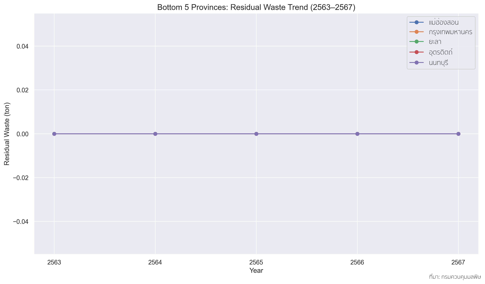
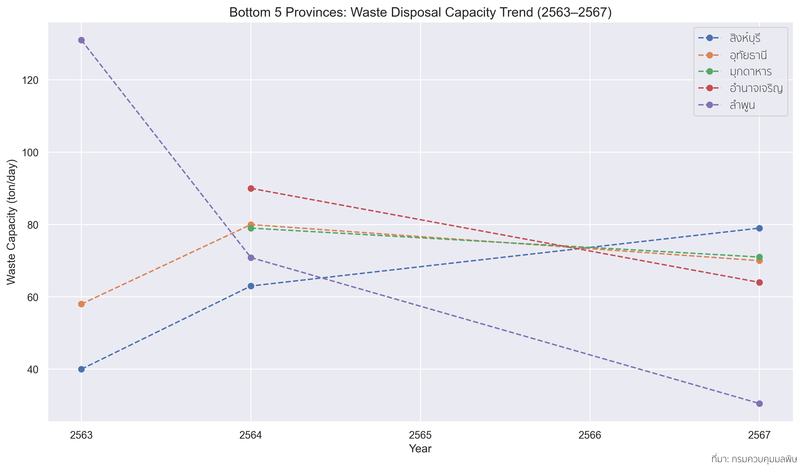
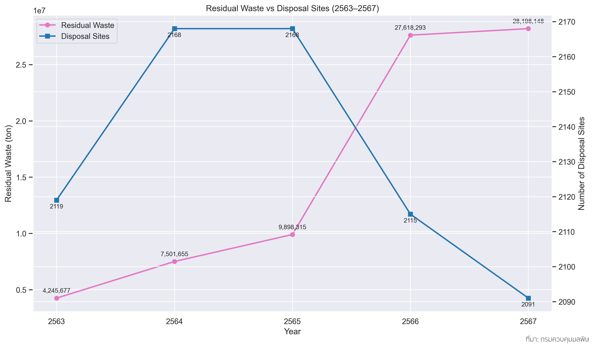
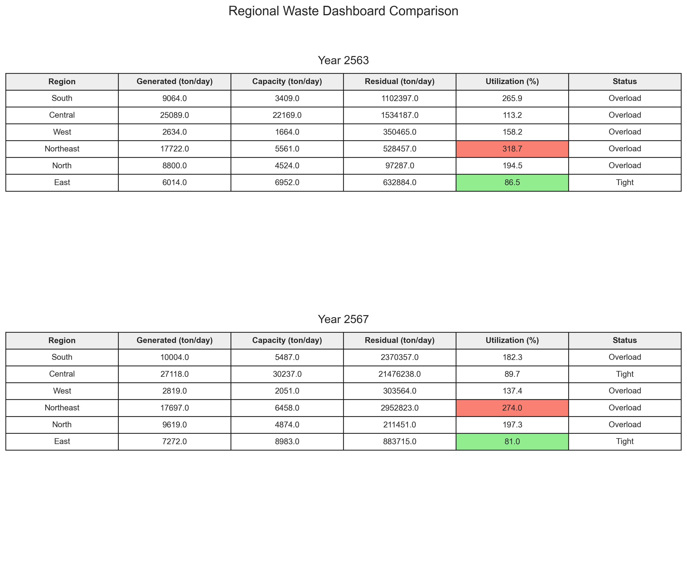

# Municipal-solid-waste: The index reflects economic and social disparities

## <mark>The expansion of municipal solid waste

## Graph 1 ASEAN Municipal Solid Waste per Capita

## Graph 2 ASEAN Annual Municipal Solid Waste

จากกราฟที่ 1 และ 2 พบว่า ในปี 2559 ประเทศไทยมีปริมาณขยะมูลฝอยรวมประมาณ 26.77 ล้านตันต่อปี อยู่ในอันดับที่ 2 ของอาเซียน รองจากอินโดนีเซีย ขณะที่ปริมาณขยะต่อหัวประชากรอยู่ที่ประมาณ 1.05 กิโลกรัมต่อคนต่อวัน จัดอยู่ในอันดับที่ 4 ของภูมิภาค สะท้อนให้เห็นว่าประเทศไทยเป็นหนึ่งในประเทศที่มีระดับการเกิดขยะค่อนข้างสูง ทั้งในเชิงปริมาณรวมและเชิงต่อหัวประชากร

## Graph 3 Thailand MSW Trend

จากกราฟที่ 3 แสดงให้เห็นว่าประเทศไทยผลิตขยะมูลฝอยหลายสิบล้านตันต่อปี และปริมาณมีแนวโน้มเพิ่มขึ้นอย่างต่อเนื่องตั้งแต่ปี 2564 โดยคาดว่าเพิ่มขึ้นตามการขยายตัวของเมือง จำนวนประชากร การท่องเที่ยว พฤติกรรมการใช้ทรัพยากร เช่น การใช้ครั้งเดียวแล้วทิ้ง และพฤติกรรมการใช้ชีวิตที่เปลี่ยนแปลงไป เช่น การสั่งอาหารส่งถึงบ้านที่คาดว่ามีปริมาณมากขึ้นหลังวิกฤตโควิด-19 เป็นต้น
หากมองไปถึงเบื้องหลังเกี่ยวกับการจัดการขยะมูลฝอยเหล่านั้น ดูเหมือนในเมืองใหญ่น่าจะมีการจัดการที่ดี มีรถเก็บขยะในทุกเช้า มีระบบคัดแยกและกำจัดที่ทันสมัย แต่ในชนบทบางแห่งยังคงมีการเผาขยะกลางแจ้งหรือทิ้งรวมกันโดยไร้ระบบจัดการ ซึ่งคาดว่าเกิดจากการขาดงบประมาณ เทคโนโลยี และการสนับสนุนที่เพียงพอ ทำให้ภาระของขยะไม่ได้ตกอยู่กับทุกคนอย่างเท่าเทียมกัน

จากข้อความข้างต้น จึงเกิดประเด็นคำถามที่ว่า ปริมาณขยะมูลฝอยมีความสัมพันธ์กับความเหลื่อมล้ำทางเศรษฐกิจและสังคมในประเทศไทยจริงหรือไม่ และสัมพันธ์กันอย่างไร โดยมีประเด็นคำถามที่สำคัญ ดังนี้
1.	ระบบการจัดการขยะมูลฝอย ได้แก่ การกำจัดขยะมูลฝอยอย่างถูกต้องและไม่ถูกต้อง และการนำขยะมูลฝอยกลับมาใช้ประโยชน์ ส่งผลต่อภาระขยะมูลฝอยของแต่ละภูมิภาคในประเทศไทยหรือไม่ อย่างไร
2.	สถานที่กำจัดขยะมูลฝอยในปัจจุบันมีจำนวนและศักยภาพเพียงพอต่อปริมาณขยะมูลฝอยที่เกิดขึ้นหรือไม่ เมื่อพิจารณาจากกำลังการรองรับ (Capacity) ของสถานที่กำจัดขยะมูลฝอยเทียบกับปริมาณขยะมูลฝอยที่เกิดขึ้นและปริมาณขยะมูลฝอยตกค้าง
3.	ฐานะทางเศรษฐกิจและสังคมของแต่ละภูมิภาค โดยพิจารณาจากผลิตภัณฑ์มวลรวมจังหวัด (GPP) จำนวนโรงงาน จำนวนนักท่องเที่ยว และจำนวนประชากร ส่งผลต่อปริมาณขยะมูลฝอยที่เกิดขึ้นและการจัดการขยะเหล่านั้นหรือไม่ อย่างไร

## <mark>Sources of municipal solid waste

## Thailand MSW by Region

## Thailand MSW per capital by Region

## Thailand MSW per area by Region

## Top5 MSW Trend

## Bottom5 MSW Trend

## GPP, Factory, Tourist vs Waste by Region (2566)
.png)

หากพิจารณาปริมาณขยะมูลฝอยในแต่ละภาคเทียบกับตัวแปรที่คาดว่าเป็นปัจจัยที่ทำให้เกิดขยะมูลฝอย โดยในที่นี้จะพิจารณาเฉพาะจำนวนประชากร จำนวนโรงงาน จำนวนนักท่องเที่ยว และผลิตภัณฑ์มวลรวมจังหวัด จากข้อมูลในปี 2566 (เนื่องจากข้อจำกัดของข้อมูล) ตามกราฟที่ ... พบว่า
- จำนวนประชากรมีความสัมพันธ์เชิงบวกที่ค่อนข้างสูงกับปริมาณขยะมูลฝอย : ภาคที่มีจำนวนประชากรมากอย่างภาคกลางจะมีขยะมูลฝอยปริมาณมาก ภาคที่มีจำนวนประชากรน้อยอย่างภาคตะวันออกจะมีขยะมูลฝอยปริมาณน้อย สะท้อนให้เห็นว่าประชากรเป็นปัจจัยสำคัญที่ทำให้เกิดขยะมูลฝอย
- จำนวนโรงงานมีความสัมพันธ์เชิงลบเล็กน้อยกับปริมาณขยะมูลฝอย : ภาคตะวันออกที่มีโรงงานจำนวนมาก แต่มีปริมาณขยะมูลฝอยน้อย ในขณะที่ภาคกลางมีปริมาณขยะมูลฝอยมากที่สุด แต่จำนวนโรงงานไม่ได้มากนักเมื่อเทียบกับปริมาณขยะมูลฝอย ดังนั้น จำนวนโรงงานไม่ได้สัมพันธ์กับปริมาณขยะมูลฝอยโดยตรง อาจเนื่องมาจากโรงงานมักมีระบบจัดการขยะตามมาตรฐานอุตสาหกรรม
- จำนวนนักท่องเที่ยวมีความสัมพันธ์เชิงบวกในระดับปานกลางกับปริมาณขยะมูลฝอย : ภาคกลางมีปริมาณขยะมูลฝอยมากตามจำนวนนักท่องเที่ยว ภาคใต้มีนักท่องเที่ยวจำนวนมาก แต่ปริมาณขยะมูลฝอยไม่ได้มากนัก ในขณะที่ภาคตะวันออกเฉียงเหนือมีปริมาณขยะมูลฝอยมากเมื่อเทียบกับจำนวนนักท่องเที่ยว สะท้อนให้เห็นว่าการท่องเที่ยวอาจส่งผลต่อปริมาณขยะมูลฝอย แต่ไม่ใช่ปัจจัยหลัก นักท่องเที่ยวเป็นประชากรแฝงที่มีส่วนในการเพิ่มภาระขยะ
- ผลิตภัณฑ์มวลรวมจังหวัดมีความสัมพันธ์เชิงบวกสูงมากกับปริมาณขยะมูลฝอย : ภาคที่มีผลิตภัณฑ์มวลรวมจังหวัดสูงอย่างภาคกลางจะมีขยะมูลฝอยปริมาณมาก ภาคที่มีผลิตภัณฑ์มวลรวมจังหวัดต่ำอย่างภาคเหนือ ใต้ และตะวันออกจะมีขยะมูลฝอยปริมาณน้อย จึงอนุมานได้ว่า พื้นที่ที่มีฐานะทางเศรษฐกิจสูงมักจะสร้างขยะมากขึ้นจากกิจกรรมทางเศรษฐกิจและการบริโภค

จากการวิเคราะห์เบื้องต้น พบว่า ผลิตภัณฑ์มวลรวมจังหวัดและจำนวนประชากรเป็นปัจจัยสำคัญที่ทำให้เกิดขยะมูลฝอย จำนวนนักท่องเที่ยวเป็นปัจจัยหนึ่งที่มีส่วนในการสร้างขยะมูลฝอยเพิ่มขึ้น แต่จำนวนโรงงานไม่ได้ส่งผลต่อปริมาณขยะมูลฝอยอย่างมีนัยสำคัญ

## <mark>Structure of the municipal solid waste management system

## Annual waste disposal capacity

## Residual waste map

## Top5 Residual waste trend

## Bottom5 Residual waste trend

## Top5 Disposal capacity trend

## Bottom5 Disposal capacity trend

## Disposal waste vs Site

## Residual Waste vs Waste Generated
.png)

## Waste Summary 

## <mark>Municipal solid waste: Past management structures and Current burden

## <mark>Municipal solid waste and Disparities

## <mark>Summary

ขยะมูลฝอยเป็นหนึ่งในภาพสะท้อนของการพัฒนาและการใช้ชีวิตของคนในสังคมไทย แต่จากผลการวิเคราะห์ข้อมูลเบื้องต้นแสดงให้เห็นว่าภาระของขยะไม่ได้ตกอยู่กับทุกคนอย่างเท่าเทียมกัน บางจังหวัดสร้างมูลค่าทางเศรษฐกิจสูงและสามารถจัดการขยะได้อย่างมีประสิทธิภาพ ขณะที่บางจังหวัดต้องเผชิญกับขยะตกค้าง การกำจัดไม่ถูกต้อง และความเสี่ยงด้านสุขภาพและสิ่งแวดล้อม หากต้องการสังคมที่ยั่งยืน เราจำเป็นต้องมองขยะในฐานะประเด็นความเหลื่อมล้ำ ไม่ใช่เพียงประเด็นความสะอาด เนื่องจากการจัดการขยะที่เป็นธรรมคือหนึ่งในรากฐานของคุณภาพชีวิตที่เท่าเทียมกันในทุกพื้นที่ของประเทศ โดยการแก้ปัญหาขยะมูลฝอยไม่ใช่เพียงการเพิ่มถังขยะหรือสร้างหลุมฝังกลบเพิ่ม แต่ต้องมองในกรอบความเป็นธรรมด้านสิ่งแวดล้อม ให้ทุกจังหวัดมีศักยภาพจัดการขยะอย่างเหมาะสม และให้ผลประโยชน์จากการพัฒนาเศรษฐกิจกระจายกลับมาชดเชยต้นทุนด้านสิ่งแวดล้อมอย่างสมดุล
